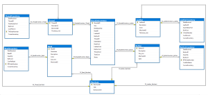

I was looking for a way to showcase my skills using SQL Server, SSMS and Telerik Report Designer.  As luck would have it, I was also starting to make and sell leather and gemstone beaded bracelets.  I created this database to keep track of supplies and costs as well as a Crosstab Report to track bracelet inventory.

Here is my Bracelet Database Diagram with Foreign Key Relationships.

_Click image to see fullsize_

Here are the [Create Table Scripts](tables.sql) edited for readability.

To create a Telerik Report, you must decide what parameters (if any) the user will need to select.

I decided that it would be useful to search by Bead (Gemstone), Bracelet Size, Button (I have a variety of fun buttons used for clasps) and Status (Available/Sold).

Here are the [Parameter Queries](inventoryreport.sql) that were used to populate the select options.  

